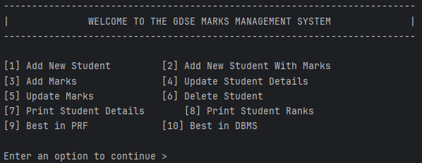

# GDSE Marks Management System

A **Java console application** for managing student records and marks in different subjects.
Completed as a part of IJSE CMJD-module 1 coursework.

## Features
- Add / Update / Delete Students  
- Add / Update Marks  
- View Student Details & Ranks  
- Show Best in PRF & DBMS  

## Preview

